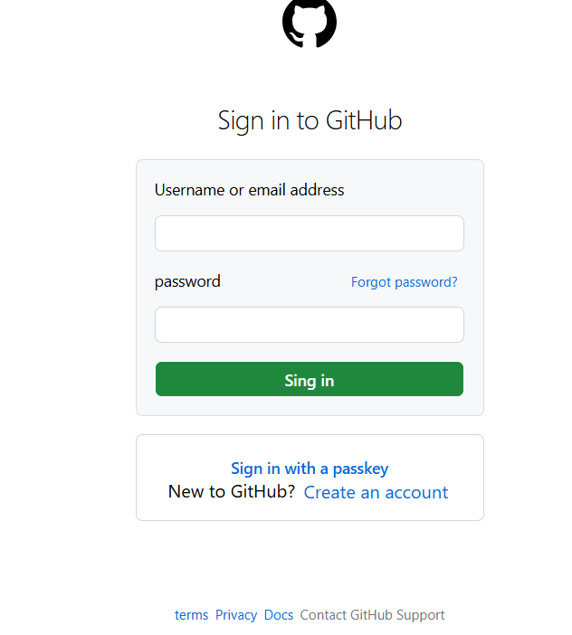

# Clone Github

<p align="center">
  
</p>

## 📋 Sobre o Projeto

Este projeto é um clone da interface do Github, desenvolvido com o objetivo de praticar e aprimorar habilidades em HTML e CSS. O projeto recria a página inicial do Github, mantendo sua aparência visual e layout responsivo.

## 🚀 Tecnologias Utilizadas

- HTML5
- CSS3
- Bootstrap

## 🔗 Links

- [Deploy na Vercel](https://clone-github-six.vercel.app/)
- [Repositório Original](https://github.com/Lazarokaua/Clone-Github)

## 💻 Funcionalidades

- Layout responsivo
- Interface fiel ao design original do Github
- Elementos visuais interativos

## 🎨 Layout

O projeto foi desenvolvido com foco na fidelidade visual em relação à interface original do Github, incluindo:

- Header com navegação
- Seção principal
- Elementos de UI consistentes com a plataforma Github

## 🛠️ Como Executar o Projeto

1. Clone este repositório:

```bash
git clone https://github.com/Lazarokaua/Clone-Github.git
```

2. Navegue até o diretório do projeto:

```bash
cd Clone-Github
```

3. Abra o arquivo `index.html` em seu navegador

## 👨‍💻 Autor

- [Lázaro Kauã](https://github.com/Lazarokaua)


---

⭐️ Se você gostou deste projeto, por favor, considere dar uma estrela no repositório!
